# Vendor Lifecycle

Generic **vendor onboarding, ongoing engagement, and deboarding** workflow for ERPNext.

Every vendor goes through the same enforced pipeline — Onboarding Request → KYC → Background Check → Compliance Audit → Sampling Evaluation → Sign-off — before their Supplier record can be used, and a mirrored Deboarding pipeline before it's disabled again. Each stage's mandatory-ness, pass/fail method, and threshold is configurable per business, not hardcoded.

## Why this matters

Standard ERPNext gives every vendor a bare Supplier record — a name, a group, some contact fields — with no structured way to prove a vendor was actually vetted before you started buying from them, or to enforce that vetting consistently across every vendor added to the system. Today the workarounds are either onboarding vendors directly into the Supplier master with no gating at all (a Purchase Order can go out to a vendor whose PAN/GSTIN was never validated and who never passed a compliance audit or background check), or running the actual vetting process outside ERPNext entirely — email threads, spreadsheets, Google Forms — with someone manually copying the outcome into the Supplier master days later and no record left of who approved what. This app closes that gap by putting the entire pipeline inside ERPNext itself: onboarding stops depending on someone remembering to follow the checklist, PAN/GSTIN get format- and (where India Compliance is installed) government-validated automatically, a failed stage disables the Supplier instead of quietly sitting unresolved, and a deboarded vendor is hard-blocked from new Purchase Orders and RFQs.

Two things worth weighing before adopting this on a live site:

- **Existing Suppliers aren't backfilled.** A Supplier created before this app was installed has no Vendor KYC or stage history at all — any dashboard or report that assumes every Supplier has a lifecycle status will show blanks for vendors onboarded before adoption.
- **The pipeline adds real process overhead.** A team used to typing a Supplier name and moving on now goes through Onboarding Request → KYC → (optionally) Background Check → Compliance Audit → Sampling → Sign-off before a vendor is fully Active. For low-risk vendors this can be a genuine slow-down — tune which stages are mandatory in Vendor Lifecycle Settings rather than running the full pipeline for every vendor by default.

## What it does

Everything lives under one workspace, organised into Onboarding, Deboarding, Ongoing Engagement, and Masters & Settings:

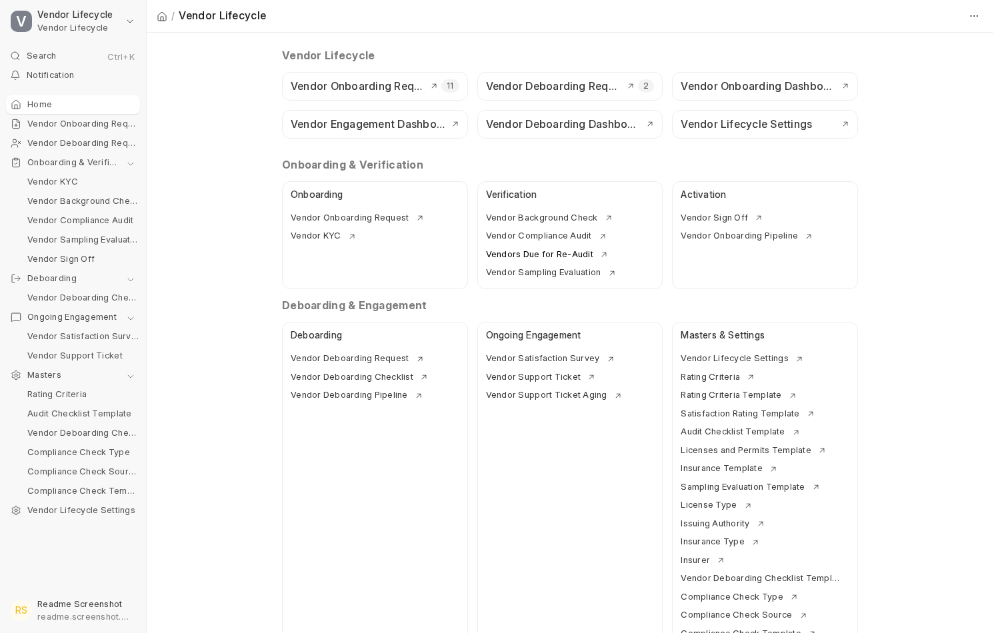

**Onboarding.** A Vendor Onboarding Request (public web form or staff-entered) becomes a Vendor KYC on approval, which auto-creates the real Supplier/Contact/Address/Bank Account on submit:

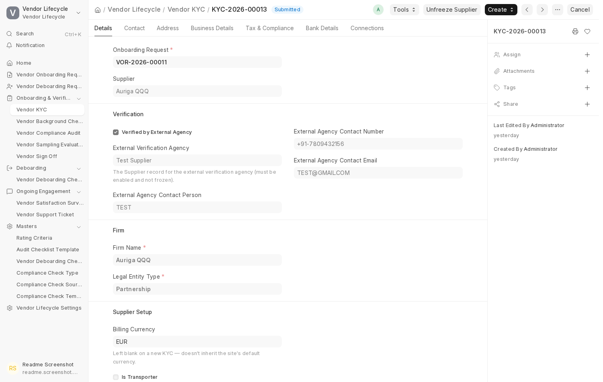

From there, up to four independently-configurable stages run in sequence — each disables the Supplier automatically on a Failed/Rejected outcome, and reverts that disable if it was the one responsible when cancelled:

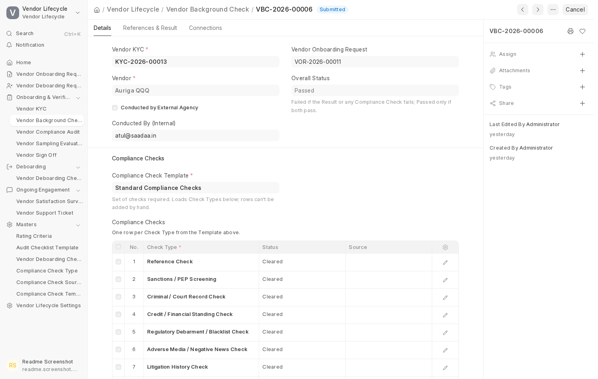
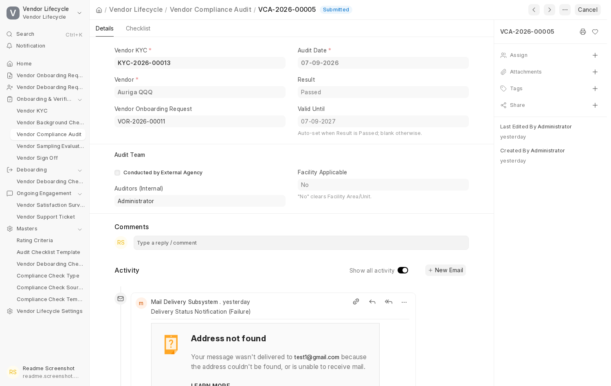

Sampling Evaluation can be made mandatory only for specific Business Types, so it's skipped entirely — straight from Compliance Audit to Sign-off — for business types not listed:

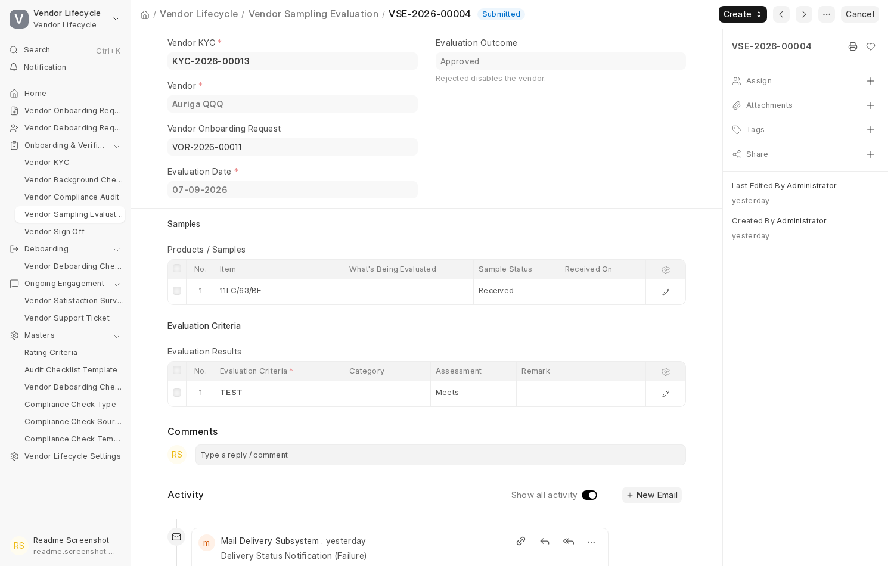

Sign-off is the final gate — contract and code of conduct sent and collected by email, activating the Supplier on success. Unlike the other three stages, a genuine Failed Sign-off can be retried directly, without cancelling the failed record first — the retry links back to the attempt it's replacing, and the KYC's own "Create" menu labels it distinctly as a retry, not a fresh attempt:

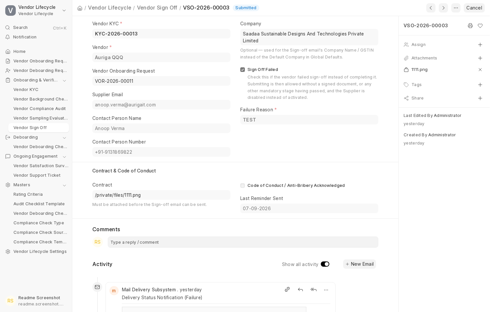
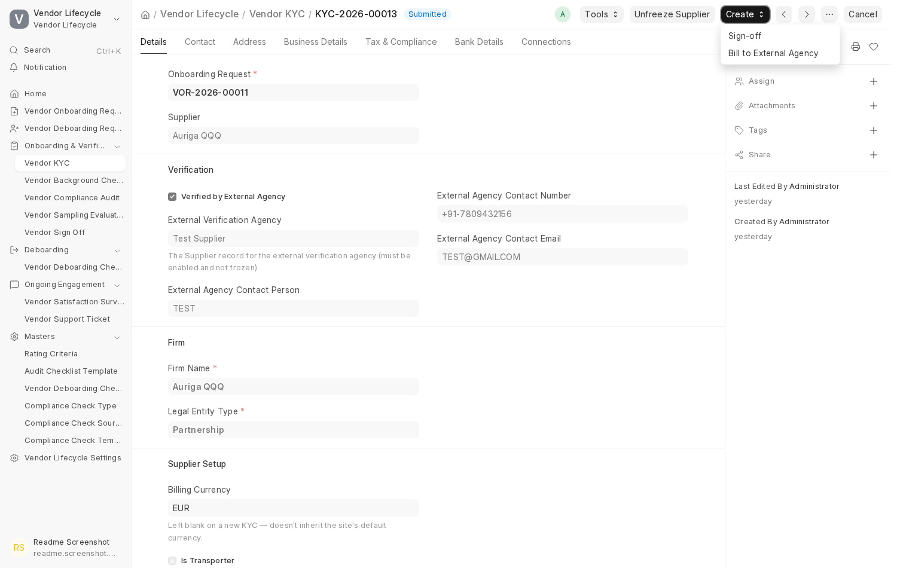

**Ongoing Engagement.** Once active, Satisfaction Surveys are auto-created per vendor on a configurable cadence, and vendors (or staff) can raise Support Tickets with priority-based escalation — both reachable by vendors through a login-gated portal, with no Desk access needed:

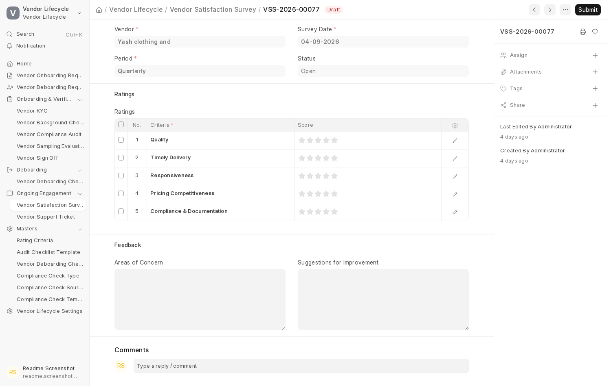
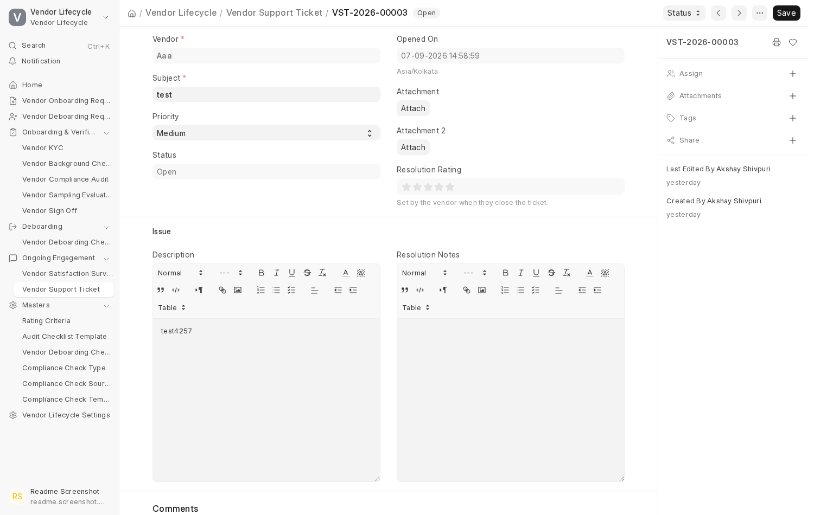

**Deboarding.** A Vendor Deboarding Request captures the reason and a ratings review, with live visibility into any open Purchase Orders or unpaid invoices before it's approved:

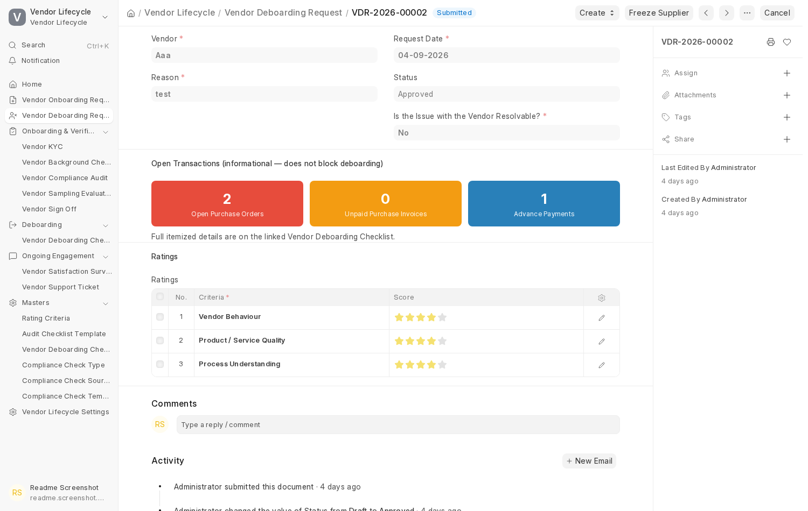

Once approved, a configurable Vendor Deboarding Checklist walks the closure through to completion — a signed Clearance Certificate is emailed to whichever contact is on file (KYC, Supplier's Primary Contact, or an additional address, deduplicated automatically) and collected back the same way — before disabling the Supplier on submit:

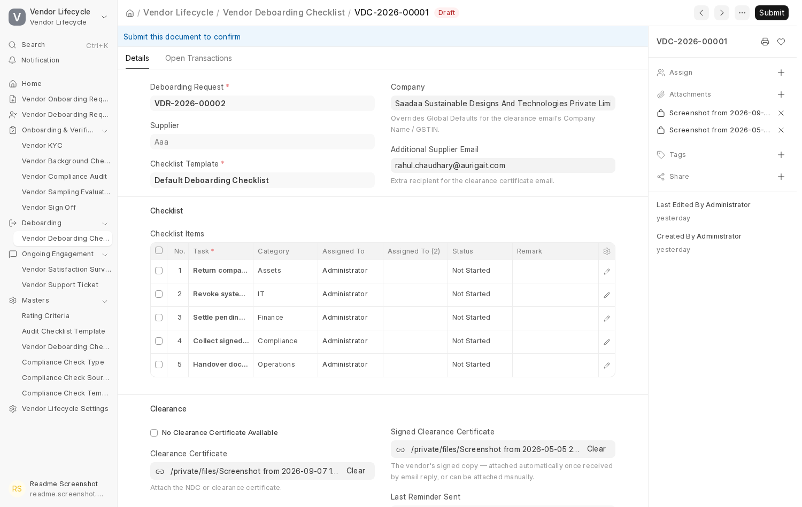

**Configuration.** One Settings screen controls almost everything above — no code change required:

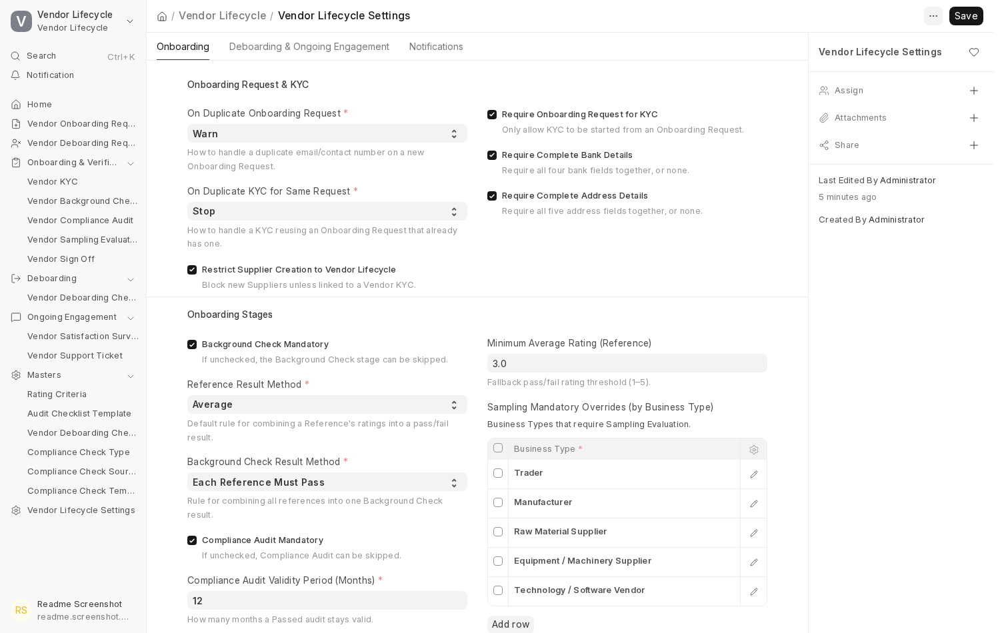

## Doctypes

| Area | Doctype | Purpose |
|---|---|---|
| Onboarding | Vendor Onboarding Request | Intake form; the only sanctioned entry point into KYC. |
| Onboarding | Vendor KYC | Core verification record every later stage links back to. |
| Onboarding | Vendor Background Check | Reference + compliance checks, with automatic pass/fail Result. |
| Onboarding | Vendor Background Check Reference | One reference contact + rating, linked to a Background Check. |
| Onboarding | Vendor Compliance Audit | Facility checklist, licenses & permits, insurance, financial stability. |
| Onboarding | Vendor Sampling Evaluation | Hands-on sample evaluation; mandatory only for configured Business Types. |
| Onboarding | Vendor Sign Off | Final activation gate; supports a linked retry after a Failed outcome. |
| Ongoing Engagement | Vendor Satisfaction Survey | Auto-created per active vendor on a configurable cadence. |
| Ongoing Engagement | Vendor Support Ticket | Vendor/staff-raised issues, with priority-based escalation. |
| Deboarding | Vendor Deboarding Request | Reason + ratings review; approve/reject gate. |
| Deboarding | Vendor Deboarding Checklist | Offboarding task list; disables the Supplier on submit. |
| Deboarding | Vendor Deboarding Checklist Template | Configurable offboarding task set a Checklist is built from. |
| Configuration | Vendor Lifecycle Settings | Single control panel — the only doctype with one record per site. |
| Masters | Rating Criteria / Rating Criteria Template | Used by Background Check References. |
| Masters | Satisfaction Rating Template | Used by Satisfaction Surveys. |
| Masters | Deboarding Rating Criteria / Deboarding Rating Template | Used by Deboarding Requests. |
| Masters | Compliance Check Type / Source / Template | Used by Background Check's compliance checks table. |
| Masters | Audit Checklist Template | Used by Compliance Audit's checklist tab. |
| Masters | License Type / Issuing Authority / Licenses and Permits Template | Used by Compliance Audit's licenses tab. |
| Masters | Insurance Type / Coverage Type / Insurer / Insurance Template | Used by Compliance Audit's insurance tab. |
| Masters | Sampling Evaluation Template | Used by Sampling Evaluation's scoring criteria. |
| Masters | State | India-specific address state list. |

## Cancel / amend behavior

- **Cancel**: each of the four onboarding stage doctypes reverts the disable it itself caused, but only if it was the one responsible — if another still-submitted Failed/Rejected record for the same vendor exists, the Supplier correctly stays disabled. Cancelling a stage is blocked outright while a later stage in the pipeline is still submitted for the same KYC (cancel later stages first, in reverse order).
- **Amend**: none of these doctypes support Frappe's native amendment — a cancelled stage document must be replaced with a fresh one. Vendor Sign Off is the one exception: after a genuine Failed outcome, a retry can be created *without* cancelling the failed record first, linked back to the attempt it's retrying.

## Reporting

Four built-in reports: **Vendor Onboarding Pipeline** (every vendor's status across all four stages in one table, viewable by Onboarding Request or by KYC), **Vendor Deboarding Pipeline**, **Vendor Support Ticket Aging**, and **Vendors Due for Re-Audit**. Three dashboards (cards + charts) cover Onboarding, Ongoing Engagement, and Deboarding. Anything beyond these — cross-vendor trend analysis over time, for example — needs a custom report, same as any Frappe app.

## Compatibility

Tested against **Frappe 16 / ERPNext 16**. Not verified against v14 or v15. The India-specific PAN/GSTIN validation and address-fetch features additionally need the [India Compliance](https://github.com/resilient-tech/india-compliance) app installed — everything else works without it.

## Known limitations / roadmap

- **No reactivation path for a fully deboarded vendor.** The only reversible mechanism today is a time-boxed "Temporarily Enable Supplier" button, not a real reactivation.
- **No multi-company scoping decided yet** — whether vendor lifecycle status and enforcement should apply per Company, or stay global across companies on a multi-company site, is still open.
- **Onboarding-stage emails aren't threaded** into one conversation — each stage's email arrives separately in the vendor's inbox.
- **No Desk-side visibility for Support Ticket conversations** beyond the description field — a reply-thread feature was built once, found to only be visible from the vendor's own portal, and reverted pending a redesign.

## Install

```bash
bench get-app https://github.com/anoopverma-collab/Vendor-Lifecycle-Management.git
bench --site <your-site> install-app vendor_lifecycle
bench --site <your-site> migrate
bench restart
```

Requires a working Frappe bench with **Frappe v16** and **ERPNext v16** already installed on the target site. The `migrate` step creates every doctype and seeds default templates, email templates, and roles with sensible defaults — nothing further to configure before using it, though every default is adjustable afterward in **Vendor Lifecycle Settings**.

## License

MIT
